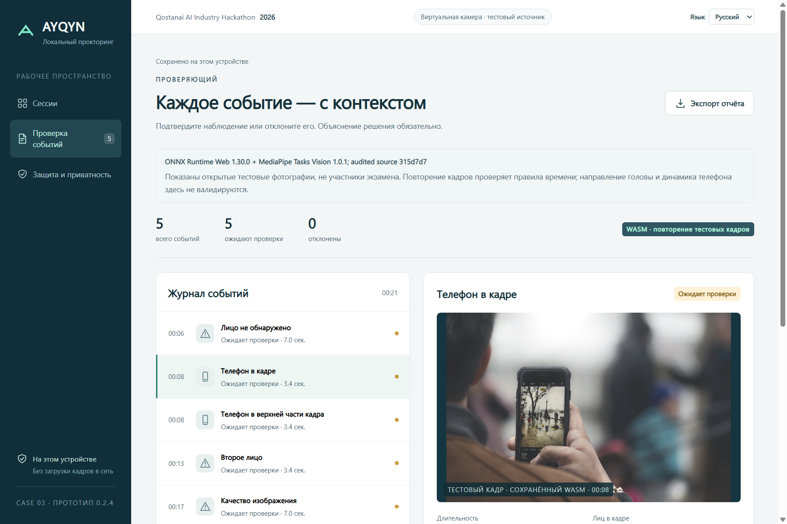
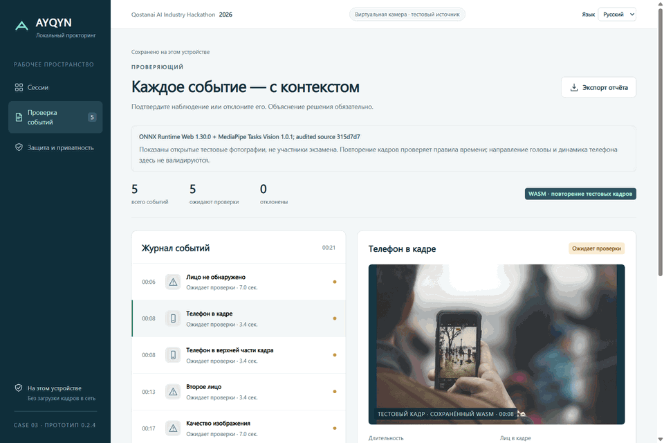
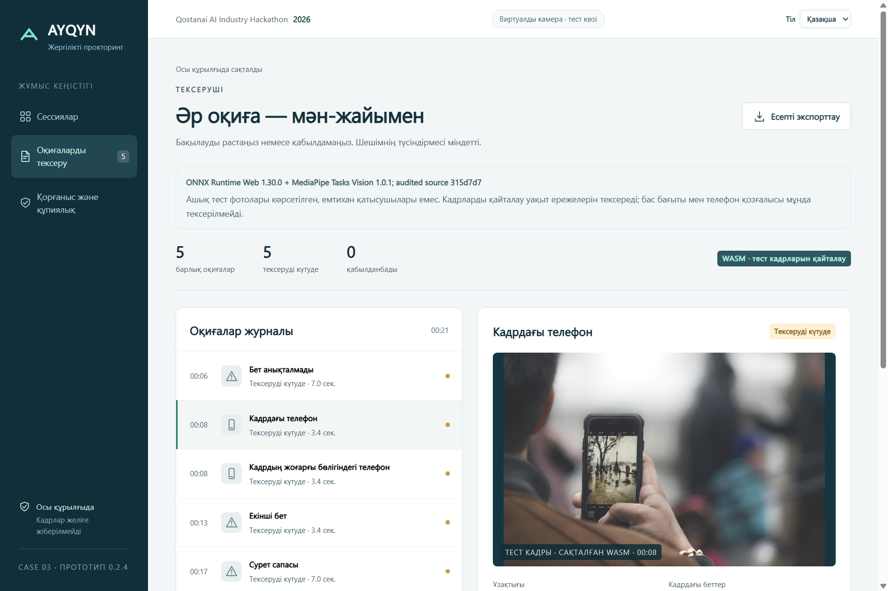
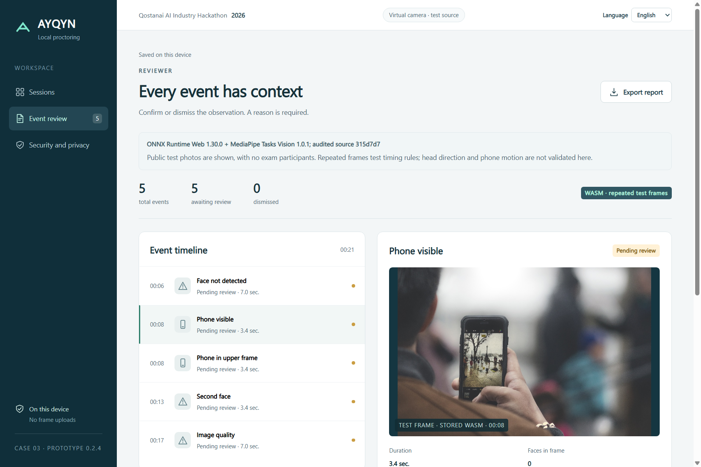
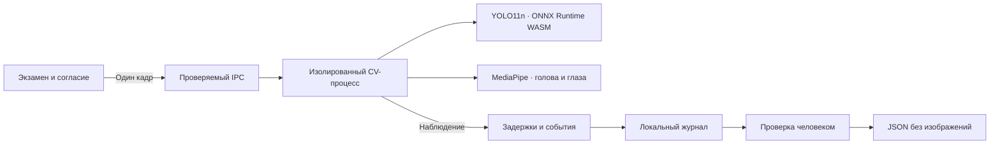

# AYQYN

**Локальный прокторинг. Наблюдения — на устройстве, решения — за человеком.**

Рабочий Windows-прототип для **Qostanai AI Industry Hackathon 2026 · Кейс №3**: телефон в кадре, присутствие и второе лицо, направление головы и приблизительная оценка взгляда, защищённая среда внутри приложения и проверка событий человеком.

[Сайт](https://seoshiro.github.io/ayqyn-local/) · [Демо без камеры](https://seoshiro.github.io/ayqyn-local/replay/) · [Windows-релизы](https://github.com/seoshiro/ayqyn-local/releases) · [Архитектура](docs/ARCHITECTURE.md) · [Проверки](docs/LOCALIZATION_QA.md)



На снимке — настоящий интерфейс Windows и лицензированный тестовый кадр. Это изолированный пример, без данных участников. [Происхождение и хеши изображений](docs/media/provenance.json).

> **Статус:** опубликована Windows-сборка **v0.2.3**. В этой ветке подготовлена **v0.2.4** с RU / KK / EN; перед новым релизом выполняются регрессия и независимая проверка. Файлы и тег v0.2.3 сохранены. Модели, пороги и алгоритмы детекции не менялись.

## Посмотреть за минуту

Откройте [браузерное демо](https://seoshiro.github.io/ayqyn-local/replay/), нажмите **«Открыть пример»**, выберите событие, напишите причину решения и подтвердите или отклоните наблюдение. Экспортируйте JSON без изображений.

В браузере воспроизводятся **сохранённые результаты реального WASM-детектора**. Публичные фото заменены схемами. Камера и модели здесь не запускаются; схемы показывают ход проверки и не служат контекстными доказательствами.



GIF записан из настоящего приложения: повторяемые лицензированные тестовые фото, смена RU / KK / EN, причина решения и экспорт. Частота 2 кадра/с; это демонстрация интерфейса, без проверки точности на движущемся человеке.

## Запустить Windows-приложение

1. Скачайте [опубликованный ZIP v0.2.3](https://github.com/seoshiro/ayqyn-local/releases/download/v0.2.3/AYQYN-Windows-v0.2.3.zip) и [контрольные суммы](https://github.com/seoshiro/ayqyn-local/releases/download/v0.2.3/SHA256SUMS-v0.2.3.txt).
2. Распакуйте **всю папку**. Запустите `AYQYN.exe` рядом с `resources` и остальными файлами.
3. Начните с примера без камеры. Для своей камеры создайте сессию и отдельно подтвердите согласие в приложении.

Модели уже включены в переносную сборку. Python, аккаунт и платный сервис не нужны. После подготовки приложение работает без интернета. Сборка не подписана цифровым сертификатом; ограничения корпоративного устройства обсуждаются с его администратором.

Подробности: [установка и проверка Windows](docs/RELEASE_WINDOWS.md), [добровольная ручная проверка](docs/MANUAL_VALIDATION.md).

## Пройти полный сценарий

| Шаг | Действие | Результат |
| --- | --- | --- |
| Сессия | Экзаменатор задаёт задержки, доступность и срок хранения | Настройки сохраняются вместе с журналом |
| Согласие | Участник разрешает локальную обработку; снимки — отдельной галочкой | Камера выключена до явного действия |
| Подготовка | Предпросмотр, освещение, 12 стабильных наблюдений для калибровки | Личная базовая позиция головы и глаз |
| Экзамен | Локальные модели обрабатывают кадры; ответы сохраняются | События получают время, длительность и контекст |
| Проверка | Человек подтверждает или отклоняет событие с причиной | Решение можно пересмотреть |
| Экспорт | Сохраняется JSON с параметрами и решениями | Сырые изображения исключены |

**Остановить экзамен:** кнопка **«Прервать»**. В активном окне также доступно **Ctrl + Shift + Esc**. Камера освобождается; журнал и ответы сохраняются для восстановления.

## Русский · Қазақша · English

Язык выбирается в шапке приложения и сайта и сохраняется на следующий запуск. Переключение меняет текст существующих элементов: согласие, ответы, черновик причины, калибровка и активный видеопоток сохраняются. Название экзамена и пользовательские ответы остаются в исходном виде. Машинные ключи событий и схема JSON одинаковы для всех языков.

| Қазақша | English |
| --- | --- |
|  |  |

Неизвестная настройка языка приводит к русскому интерфейсу. Если будущий текст ещё не переведён, приложение сохраняет русский текст и сообщает об этом. Название и фильтр нативного экспорта переведены; системные кнопки Windows используют язык ОС. Казахский перевод требует финального редакторского просмотра носителем языка.

## Что фиксируется и где проходят границы

| Возможность | Реализация | Ограничение |
| --- | --- | --- |
| Телефон | YOLO11n, COCO-класс `cell phone` | Маленький, закрытый или похожий предмет может привести к пропуску или ложному флагу |
| Телефон поднят | Положение обнаруженной рамки в верхней части кадра | Не доказывает направление камеры телефона или намерение |
| Присутствие | MediaPipe FaceLandmarker, до двух лиц | Нет идентификации; качество кадра учитывается отдельно |
| Голова и взгляд | Матрица головы и относительная геометрия радужки после калибровки | Приблизительная оценка; очки, освещение и ракурс влияют на результат |
| Среда экзамена | Ограничения копирования и навигации внутри приложения, наблюдение потери фокуса, добровольный полный экран | **Alt+Tab, Win, PrtScn и другие приложения остаются под контролем ОС** |
| Проверка | Контекст и обязательная причина решения человека | Наблюдение не доказывает нарушение и не влияет автоматически на оценку |

Прототип не устанавливает глобальные перехватчики клавиш и не активирует управляемую Windows-среду. [Матрица возможностей и угроз](docs/THREAT_MODEL.md).

## Как устроена локальная обработка



Electron **44.5.1**, ONNX Runtime Web **1.30.0**, MediaPipe Tasks Vision **1.0.1**. Вычисления идут на CPU. Перед загрузкой проверяются размеры и SHA-256 **12 локальных runtime-ресурсов**. Текущий путь не использует Python.

Главное окно, CV-процесс и узкий preload разделены. Разрешения на видео привязаны к согласию и доверенному локальному окну; микрофон не запрашивается. Исходящие запросы ограничиваются CSP и проверками сессии. [Runtime и воспроизводимость](docs/RUNTIME_WASM.md), [офлайн-манифест](web/runtime-manifest.json).

## Установка из исходников

Нужны **Node.js 24** и **pnpm 11.19.0**. Первичная установка зависимостей и моделей требует интернет; все компоненты бесплатны.

```powershell
git clone https://github.com/seoshiro/ayqyn-local.git
cd ayqyn-local
./scripts/setup.ps1
pnpm start
```

Без камеры и без установки моделей:

```powershell
node scripts/serve.mjs
```

Откройте `http://127.0.0.1:4173`. Локальный браузерный пример показывает лицензированные тестовые фото; публичная сборка заменяет их схемами.

## Проверки и воспроизводимость

```powershell
pnpm install --frozen-lockfile
pnpm lint
pnpm typecheck
pnpm test
node scripts/audit-source.mjs
node scripts/audit-app-invariants.mjs
node scripts/build-site.mjs
node scripts/audit-site-build.mjs
```

`typecheck` — настоящая проверка TypeScript `checkJs/noEmit` для каталога, DOM-локализации, языкового IPC и нативных настроек. Остальной JavaScript проверяется lint, синтаксисом, строгими runtime-схемами и поведенческими тестами; полного статического покрытия CV пока нет.

Регрессия включает отмену отложенного старта, отказ разрешений, остановившиеся кадры, отзыв согласия, отдельное разрешение снимков, восстановление, причины решений, конкурирующие браузерные вкладки и экспорт. Новый языковой аудит проверяет три языка, ширины 320–1440 px и активный синтетический экзамен. Нативный аудит использует только **file-backed virtual camera** с лицензированными тестовыми кадрами; реальный CV проверяется отдельно от сценарных наблюдений.

Результаты, точные команды и оставшиеся проверки: [LOCALIZATION_QA.md](docs/LOCALIZATION_QA.md). Проверяйте SHA конкретного релиза и CI этого commit. Установка в новую папку на этом компьютере отличается от чистой ОС; точность физической камеры на реальных экзаменах отдельно не сертифицирована.

## Приватность и данные

- Видео обрабатывается на устройстве. Аудио, база идентификации и анализ эмоций отсутствуют.
- Снимки событий выключены по умолчанию и требуют отдельного согласия; JSON их не содержит.
- Сессия хранится в профиле приложения. По умолчанию — 24 часа; очистка выполняется при следующем открытии. Есть ручное удаление.
- Файлы защищаются учётной записью ОС. Администратор устройства может изменить локальные данные; криптографической гарантии журнала нет.
- Сайт не обращается к камере и не собирает аналитику. В браузере сохраняется язык и состояние открытого демо.
- Публичные медиа содержат только проверенные тестовые материалы. Исходные PDF организаторов и личные данные в репозиторий не включены.

## Лицензии и вклад AI

AYQYN и YOLO распространяются по **AGPL-3.0-only**; соответствующий исходный код включается в пакет. MediaPipe — **Apache-2.0**, ONNX Runtime — **MIT**; условия остальных компонентов и моделей указаны в [licenses](licenses/) и [манифесте](web/runtime-manifest.json).

Тестовые изображения: CC0, NASA public domain и отдельный CC-BY-SA-4.0 материал. Точная атрибуция и преобразования — [web/fixtures/attribution.json](web/fixtures/attribution.json). Использование фото не означает одобрения проекта изображёнными людьми или авторами.

Код, интерфейс, переводы, документация и тесты подготовлены при помощи **Codex** по требованиям капитана. Публичные модели не обучались командой. Для защиты проекта команда должна понимать калибровку, задержки, границу IPC, хранение и ограничения ОС. AYQYN — рабочее название проекта; окончательное название команды ещё не утверждено.
