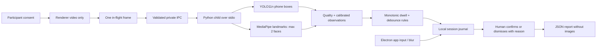

# AYQYN architecture checkpoint

New project for Case 3. Working name AYQYN; no final team identity asserted.

Electron main owns process lifecycle, permissions, app guard and atomic file saves. Renderer has no Node access, uses context isolation and sandbox, and receives a narrow IPC bridge. Custom secure local protocol serves packaged assets; remote navigation, popups and webviews are denied. Python never opens a camera and never listens on a network port. Models are checked against the asset manifest on startup. Runtime download is disabled. No microphone, face identity database, emotion or demographic inference.

The camera starts only after the checkbox and button action. Optional event snapshots need a separate policy option and participant consent. Stop, emergency exit, worker failure and app close release the camera and worker. Native keys are scoped to the application. OS-wide restrictions are neither installed nor activated.

## Case fit and honest boundaries

| Requirement | Implementation | Evidence / remaining gap |
|---|---|---|
| Phone visible in hand / near screen | COCO `cell phone` class resolved by model metadata | Real attributed photos; retain misses. No guarantee for occlusion or back-facing phones. |
| Phone raised / aimed | Box in upper frame, size threshold; rising trajectory logged | Raised-position proxy only. Camera orientation or intention not established. |
| Head / eye direction | solvePnP from face landmarks + relative iris location | Individual median calibration; coarse proxies. Physical sign and eyeglasses validation pending. |
| Sustained down / side look | Configurable dwell, quality gating and cooldown | Deterministic rule tests. Real labelled exam sequences still needed. |
| Presence / second face | MediaPipe max 2, explicit pose smoothing | Real face photo and derived composites; small faces may be missed. |
| Ctrl+C/V, navigation | Electron native before-input-event + renderer clipboard guard | Scoped active-exam integration test. |
| Alt+Tab / other window | Window blur / tab visibility event | Observed, not OS-blocked. |
| Win / PrtScn | Capability UI shows unavailable enforcement | Requires supported managed Windows policy; not configured. |
| Human review | Timeline, contextual metrics, reason-required resolution | E2E persistence and export. No scoring/discipline. |
| Local/offline | Private pipes; local models and assets | No CV server or remote camera uploads; cache dependencies once. |

Windows Keyboard Filter is edition-dependent and requires administrator deployment. Ordinary single-app Assigned Access does not universally accept arbitrary Electron apps. The prototype's bounded app mode must not be presented as a managed secure testing workstation.

Primary implementation references: [Electron security](https://www.electronjs.org/docs/latest/tutorial/security), [before-input-event](https://www.electronjs.org/docs/latest/api/web-contents#event-before-input-event), [MediaPipe Face Landmarker](https://developers.google.com/edge/mediapipe/solutions/vision/face_landmarker/python), [YOLO11](https://docs.ultralytics.com/models/yolo11), [Ultralytics license](https://www.ultralytics.com/license), [Windows Keyboard Filter](https://learn.microsoft.com/en-us/windows/configuration/keyboard-filter/).
