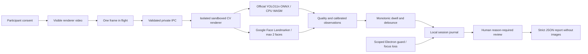

# AYQYN architecture v0.2

New local project for Case 3; AYQYN is a provisional name.

Electron main owns permissions, lifecycle, window guard and atomic storage. Neither renderer has Node access. Both use context isolation and sandbox; CV renderer has a separate session, no media permission and no network endpoint. Secure custom protocol serves local files. Remote navigation, new windows and webviews are denied. Main verifies all 12 JS/WASM/model assets against frozen SHA256 and size pins before startup. No runtime downloads, Python subprocesses or CV server.

Main deduplicates host/model initialization; stop invalidates pending work by generation and destroys CV host. Only the visible trusted main frame can invoke the narrow bridge. Inference requires consent, initialized models, bounded JPEG payload and monotonic timestamp. Returned observations pass finite bounded schema validation before establishing exam freshness.

YOLO preprocessing uses original aspect ratio, rectangular stride-32 letterbox at 640, RGB/255 NCHW, padding 114, phone class 67, confidence .45 and IoU .7 NMS. MediaPipe provides geometric landmarks/head matrix; relative iris position is a coarse proxy. No blendshapes, identity, emotion or demographic inference. Dwell rules require healthy observations and stable individual calibration. Main requires a fresh observation before exam mode.

Camera starts after participant consent and explicit action. Optional snapshots need a separate policy option and participant checkbox; export strips images by strict schema. Stop, revocation, sensor failure, close and Ctrl+Shift+Esc release capture/restrictions. No global hooks or OS policies are changed.

## Case capability and evidence

| Requirement | Current behavior | Evidence / limit |
|---|---|---|
| Phone in hand / near screen | Real COCO phone boxes | Attributed photos and 32-scene parity; occluded/back-facing phones may be missed |
| Raised / aimed phone | Upper-frame position/size proxy | No validated trajectory, orientation or intention claim |
| Head / eye direction | Geometric head matrix and relative iris proxy | Stable calibration; physical accuracy/sign pending labelled clips |
| Sustained down / side look | Configurable dwell, quality gate and debounce | Rule tests; real exam-video precision/recall pending |
| Presence / second face | Face Landmarker, max two faces | Original still plus derived composite; small/occluded faces may be missed |
| Ctrl+C/V and navigation | Scoped active-exam Electron input guard | Actual native Ctrl+C E2E; OS-wide shortcuts remain available |
| Alt+Tab / other window | Focus/visibility observation | Observed, not OS-blocked |
| Win / PrtScn | Enforcement exposed as unavailable | Managed Windows guidance only; not configured |
| Human review | Timestamped timeline, context and reasons | Review/reload/export E2E; no scores or discipline |
| Local / offline | Packaged WASM and models | Copied-folder real inference; air-gap/fresh-OS verification pending |

Windows Keyboard Filter is edition-dependent and requires administrator deployment. Single-app Assigned Access does not universally accept arbitrary Electron applications. Bounded app mode must not be presented as a managed secure exam workstation.

References: [Electron security](https://www.electronjs.org/docs/latest/tutorial/security), [before-input-event](https://www.electronjs.org/docs/latest/api/web-contents#event-before-input-event), [Face Landmarker Web](https://developers.google.com/edge/mediapipe/solutions/vision/face_landmarker/web_js), [ONNX Runtime Web](https://onnxruntime.ai/docs/tutorials/web/), [Ultralytics licensing](https://www.ultralytics.com/license), [Windows Keyboard Filter](https://learn.microsoft.com/en-us/windows/configuration/keyboard-filter/).
